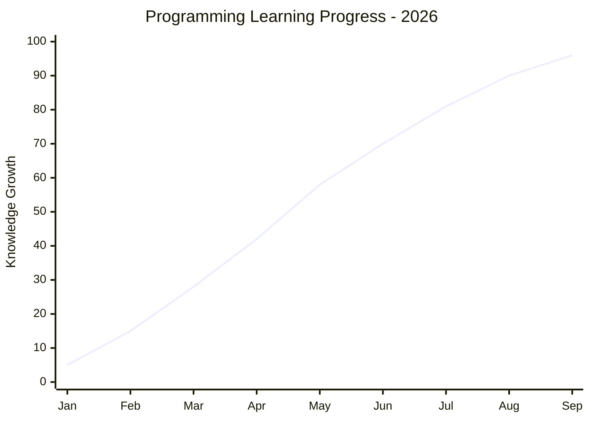
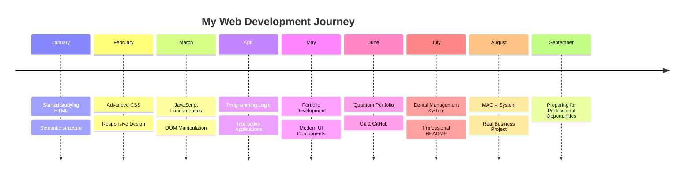
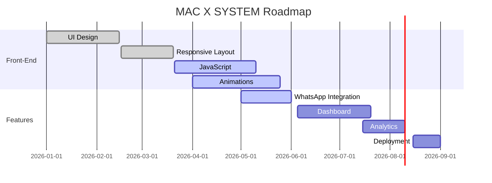

<p align="center">

  

</p>

<span align="center"> 

# PROGRAMADOR 

</span>

<span align="center">

# FULLSTACK

</span>

<h3 align="center">

Estudante de Programação 
• Desenvolvedor Web em formação 
• Construindo projetos reais

</h3>

<p align="center">
  Instituto Grau Técnico Madureira
</p>


<p align="center">

<a href="https://github.com/seuusuario">


</a>


</p>

---
<span align="center">
  


---
<span align="center">
  
# Sobre mim

</span>

Sou estudante de Programação 
e Desenvolvimento de Sistemas, 
apaixonado por tecnologia e 
desenvolvimento web.

Atualmente estou focado em evoluir 
como Desenvolvedor Front-end, 
aprofundando meus conhecimentos 
em JavaScript e iniciando minha 
jornada no desenvolvimento Full Stack.

Meu objetivo é criar aplicações modernas, 
intuitivas e com foco em experiência do 
usuário, utilizando boas práticas de 
desenvolvimento e arquitetura de software.

Hoje concentro meus estudos em HTML5, CSS3,
JavaScript, Python, Git e GitHub, UI/UX, 
Desenvolvimento Responsivo

---

# Projetos 

<div align="center">

# MAC X MÓVEIS SYSTEM 

### Transforming a traditional 
furniture business into a modern digital experience.

</div>

---

## Mission Status


```yaml
Project Name:      MAC X SYSTEM
Status:            🟢 Active Development
Client:            MAC X Móveis
Type:              Commercial Project
Architecture:      Responsive Web Application
Current Version:   v1.0
Deployment:        Preparing...
```

---


# Current Progress

```text
Planning                  ████████████████ 100%

UI / UX                   ████████████████ 100%

Responsive Layout         ███████████████░ 95%

Animations                ██████████████░░ 90%

JavaScript                █████████████░░░ 85%

Lead Generation           ████████████░░░░ 80%

WhatsApp Integration      ███████████████░ 95%

Performance               ███████████░░░░░ 75%

Future Dashboard          ███████░░░░░░░░░ 45%
```

---

# 🚀 Developer Journey 2026

> *"Every line of code represents another step toward becoming the developer I aspire to be."*

---

# 📈 Learning Evolution



---

# 🗓️ Timeline



---

# 💼 Featured Project

## 🪑 MAC X SYSTEM

```text

STATUS

█████████████████████░░░ 90%

Client:

MAC X Móveis

Category:

Commercial Web Application

Objective:

Transform a traditional furniture business into a modern digital experience.

Stack:

HTML5

CSS3

JavaScript

Git

GitHub

Responsive Design

Deployment:

Preparing for Vercel

```

---

# 🎯 Project Mission

The MAC X System is a real-world commercial project designed to modernize the customer experience of a custom furniture company.

### Main Objectives

- Premium Landing Page

- Interactive Portfolio

- Mobile First Experience

- Lead Generation

- WhatsApp Integration

- SEO Optimization

- Performance Optimization

- Modern User Experience

---

# 🔄 Customer Journey


---

# 📊 Current Progress



---

# 🚀 What's Next

- Dashboard

- Analytics

- CRM Integration

- Admin Panel

- AI Quote Assistant

- Customer Area

- Online Scheduling

- Cloud Database

- Performance Optimization

---

# 💡 Why This Project Matters

This project represents much more than a website.

It demonstrates my ability to:

✔ Analyze real business needs

✔ Design modern user experiences

✔ Build responsive interfaces

✔ Develop scalable solutions

✔ Apply JavaScript to real scenarios

✔ Create software that generates business value

---

# 🎖️ Current Mission

```text

MISSION:

Become a Professional Web Developer

CURRENT FOCUS:

Building Real Software

ACTIVE PROJECT:

MAC X SYSTEM

NEXT DEPLOY:

Vercel

NEXT GOAL:

First Professional Opportunity

STATUS:

███████████████████░░ 95%

```

---

> **"I don't just study programming. I build solutions for real businesses, continuously improving my skills through practical projects and modern web technologies."**

---


# Atualmente

Estudando Programação e Desenvolvimento de Sistemas
para alcançar o meu melhor. Assim,sigo evoluindo diariamente

# Connect with Me

</span>

<p align="center">


<a href="https://www.instagram.com/luan_mutasenji?igsh=YmRzNWowcHdlZmhy&utm_source=qr" target="_blank">

</a>

<a href="https://www.tiktok.com/@l_senji?_r=1&_t=ZS-97kYayhp1hF" target="_blank">

</a>

<a href="https://youtube.com/@l-senji?si=ee350OCf7t_9nEWv" target="_blank">

</a>

<a href="https://www.linkedin.com/in/luan-pereira-b61b06195?utm_source=share_via&utm_content=profile&utm_medium=member_ios" target="_blank">

</a>

</p>
